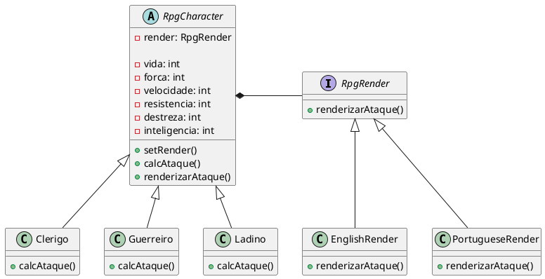

---
export_on_save:
  html: true
---

# Bridge (Padrão de Projeto Estrutural)

### Personagens de RPG X Renderização
Exemplo feito pelo time do Object Pool

## Motivação

Imagine o cenário de desenvolvimento de um jogo RPG em que exista uma variação de personagens representados por suas próprias classes, como ```Clerigo```, ```Guerreiro``` ou ```Ladino``` e também variações de como a renderização desses personagens podem ser implementadas. Levando em conta que novas classes podem surgir no decorrer de atualizações do jogo ou mesmo novas implementações de renderização, a pior maneira de resolver este problema seria criando uma classe para cada combinação de personagem X renderização possível. O Padrão **Bridge** tem o objetivo de eliminar a necessidade de criar várias classes resultantes de uma extensão no projeto, seja pela adição de uma nova abstração ou implementação.

O padrão Bridge resolve esse problema de acoplamento separando a parte do código que se refere a abstração e a parte da implementação. Fazendo com que a adição de uma nova abstração não exija o desenvolvimento de múltiplas variantes para cada implementação e virse-versa.

No exemplo em questão, a renderização dos personagens de um RPG está sendo representada simplificadamente através de impressões no console. As implementações imprimem as informações da interação entre personagem em um diferentes idiomas.

## Estrutura



## Participantes

- **RpgCharacter (Abstração)** 
  - Uma classe abstrata que define a interface de abstração.
  - Mantém uma referência para um objeto implementador.
  - Define operações de alto nível que chamam o implementador.
- **RpgRender (Implementação)**
  - Interface para classes de implementação.
  - Define operações primitivas.
- **Clerigo, Guerreiro, Ladino**
  - Classes concretas que extendem a classe abstrata RpgCharacter.
- **EnglishRender, PortugueseRender**
  - Classes concretas que implementam a interface RpgRender.

## Implementação

### RpgCharacter (Abstração)
@import "src\bridge\abst\RpgCharacter.java"

### RpgRender (Implementação)
@import "src\bridge\impl\RpgRender.java"

### Clerigo
@import "src\bridge\abst\Clerigo.java"

### Guerreiro
@import "src\bridge\abst\Guerreiro.java"

### Ladino
@import "src\bridge\abst\Ladino.java"

### EnglishRender
@import "src\bridge\impl\EnglishRender.java"

### PortugueseRender
@import "src\bridge\impl\PortugueseRender.java"

## Aplicabilidade

Quando utilizar o padrão **Bridge**:
> * Quando desejar evitar um vínculo permanente entre uma abstração e sua implementação. Isso pode ocorrer, por exemplo, quando a implementação deve ser selecionada ou alterada em tempo de execução.
> * Quando tanto as abstrações como suas implementações tiverem de ser extensíveis por meio de subclasses. Neste caso, o padrão Bridge permite combinar as diferentes abstrações e implementações e estendê-las independentemente.
> * Quando mudanças na implementação de uma abstração não puderem ter impacto sobre os clientes; ou seja, quando o código dos mesmos não puder ser recompilado.
> * Quando tiver uma proliferação de classes, como foi mostrado no primeiro diagrama da seção Motivação. Tal hierarquia de classes indica necessidade de separar um objeto em duas partes.
> * Quando desejar compartilhar uma implementação entre múltiplos objetos (talvez usando a contagem de referências) e este fato deve estar oculto do cliente.

## Colaborações

- A Abstração repassa as solicitações dos clientes para o seu objeto Implementador.
  
## Consequências

### Desacoplamento da interface e implementação
  Permite alterar a implementação em tempo de execução sem impactar a interface. Isso reduz dependências de compilação, garantindo compatibilidade binária entre versões de uma biblioteca e incentivando uma estrutura em camadas.

### Maior extensibilidade
  As hierarquias da Abstração e Implementador podem evoluir separadamente.

### Ocultação de detalhes de implementação
  Protege os clientes de complexidades internas, como compartilhamento de objetos e mecanismos de contagem de referências.
